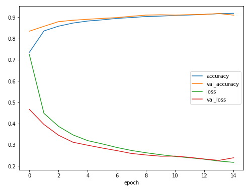
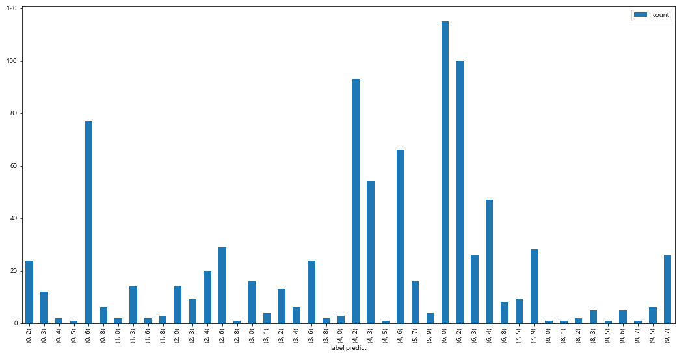
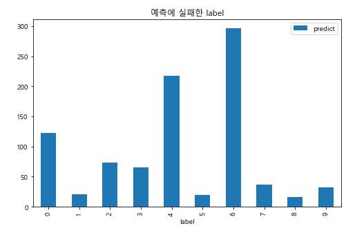
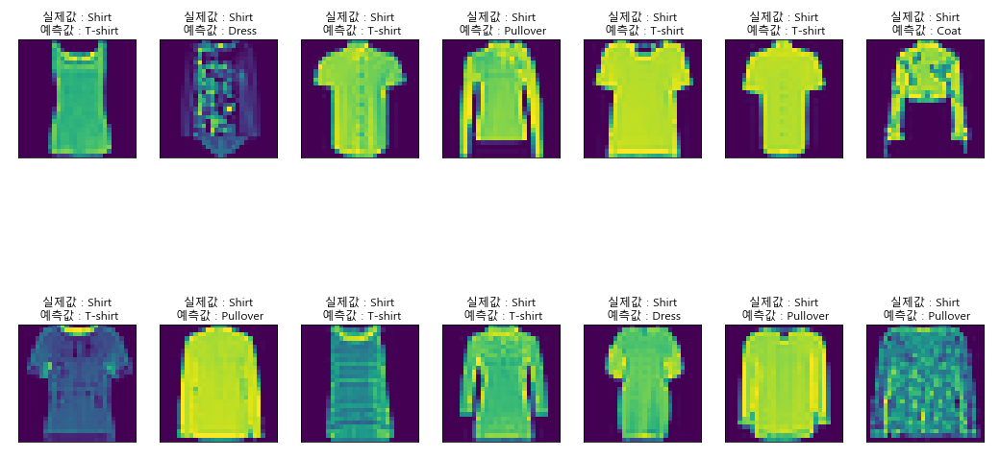

# 연습문제 1, 2

> fashion mnist 사진 분류 CNN 모델 작성 및 시각화

```python
# fashion mnist 데이터 분류 모델
from keras import *
from keras.layers import *

# keras에서 fashion_mnist 데이터 불러오기
fashion_mnist = keras.datasets.fashion_mnist
(trainImages, trainLabels),(testImages, testLabels) = fashion_mnist.load_data()

# 0~1 사이의 값으로 정규화
trainImages = trainImages / 255.0
testImages = testImages / 255.0

# 4차원으로 만들기
trainImages = trainImages.reshape(trainImages.shape+(1,))
testImages = testImages.reshape(testImages.shape+(1,))

# 원핫인코딩
from keras.utils import np_utils

trainLabels = np_utils.to_categorical(trainLabels)
testLabels = np_utils.to_categorical(testLabels)

#  모델
model = Sequential()

model.add(Conv2D(8, kernel_size=(3,3), activation='relu', input_shape=(28,28,1)))
model.add(Conv2D(16, kernel_size=(3,3), activation='relu'))
model.add(MaxPooling2D(2,2))
model.add(Dropout(0.3))

model.add(Conv2D(32, kernel_size=(3,3), activation='relu'))
model.add(Conv2D(64, kernel_size=(3,3), activation='relu'))
model.add(MaxPooling2D(2,2))
model.add(Dropout(0.3))

model.add(Flatten())

model.add(Dense(128, activation='relu'))
model.add(Dense(10, activation='softmax'))

model.compile(loss='categorical_crossentropy', optimizer='adam', metrics=['accuracy'])

model.summary()

model.fit(trainImages, trainLabels, epochs=15, batch_size=200, validation_data=(testImages, testLabels))

model.evaluate(testImages, testLabels)

# 10000/10000 [==============================] - 2s 162us/step
# [0.23854747606515883, 0.910099983215332]


# 시각화 및 가장 많이 틀린 label의 사진 출력
accuracy = model.history.history['accuracy']
val_accuracy = model.history.history['val_accuracy']

loss = model.history.history['loss']
val_loss = model.history.history['val_loss']

plt.figure(figsize=(8,6))
plt.plot(accuracy, label='accuracy')
plt.plot(val_accuracy, label='val_accuracy')
plt.plot(loss, label='loss')
plt.plot(val_loss, label='val_loss')

plt.xlabel('epoch')
# plt.ylabel(['accuracy', 'loss'])

plt.legend()
```



```python
# 예측값과 실제값 저장
predict_label = np.argmax(pre,1)
test_label = np.argmax(testLabels,1)

# 데이터프레임으로 변환
res = pd.DataFrame({'label':test_label, 'predict':predict_label})

# 예측 틀린 사진들 데이터프레임 생성
fault_res = res[res['label'] != res['predict']]
fault_res

# groupny 후 count를 위한 열 추가
fault_res['count'] = 1

fault_res.groupby(['label','predict']).count()

# 정답 레이블별 가장 많은 오답을 보기위한 시각화
fault_res.groupby(['label','predict']).count().plot.bar(figsize=(18,9))
```



```python
# 전체 label중 오답이 가장 많은 label 시각화
fault_res.groupby(['label']).count().plot.bar(figsize=(8,5))
plt.title('예측에 실패한 label')
```



```python
# 가장 많이 틀린 label의 index를 list로 저장
six_index = fault_res[fault_res['label'] == 6].index.tolist()

# 실제값과 예측값이 다른 이미지 출력
targetlist = []

plt.figure(figsize=(18,10))
for i in range(14) :
    
    target = random.choice(six_index)
    # 중복 출력을 막기위한 조건문
    if target not in targetlist :
        targetlist.append(target)
        
        plt.subplot(2,7,i+1)
        plt.imshow(testImages[target].reshape(28,28))
        plt.xticks([])
        plt.yticks([])

        ans = res.iloc[target]['label']
        pred = res.iloc[target]['predict']
        plt.title('실제값 : {}\n 예측값 : {}'.format(classNames[ans],classNames[pred]))
```




# 연습문제 3

> kaggle 위성관측 사진에서 항공기 찾는 CNN 모델

```python
import os
import re

# 사진 목록 불러오기
filelist = os.listdir('data/planesnet')

# 사진 이름에서 0으로 시작하면 X 1로 시작하면 O를 나타내는 데이터프레임 생성
label = []
for i in filelist :
    if re.search('0\_\_+',i) :
        label.append('X')
    else :
        label.append('O')
        
df = pd.DataFrame({'filename':filelist, 'label':label})
df['label'].value_counts()

X    24936
O     7065
Name: label, dtype: int64
        

# train, test 데이터 나누기
from sklearn.model_selection import train_test_split

traindf, testdf = train_test_split(df, test_size=0.3, random_state=777)        
        
from keras.preprocessing.image import ImageDataGenerator

# 이미지 제너레이터 만들기
idg = ImageDataGenerator(rescale=1./255)

# 데이터프레임으로부터 데이터셋 만들기
train_idg = idg.flow_from_dataframe(traindf, directory='data/planesnet',
                       x_col='filename',
                       y_col='label',
                       target_size=(20,20),
                       class_mode='binary',
                       batch_size=200)
test_idg = idg.flow_from_dataframe(testdf, directory='data/planesnet',
                       x_col='filename',
                       y_col='label',
                       target_size=(20,20),
                       class_mode='binary',
                       batch_size=200)
        
        
# 모델 만들기 

model = Sequential()

model.add(Conv2D(8, kernel_size=(3,3), activation='relu', input_shape=(20,20,3)))
model.add(Conv2D(16, kernel_size=(3,3), activation='relu'))
model.add(MaxPooling2D(2,2))
model.add(Dropout(0.3))

model.add(Conv2D(32, kernel_size=(3,3), activation='relu'))
model.add(Conv2D(64, kernel_size=(3,3), activation='relu'))
model.add(MaxPooling2D(2,2))
model.add(Dropout(0.3))

model.add(Flatten())

model.add(Dense(128, activation='relu'))
model.add(Dense(1, activation='sigmoid'))

# 모델 설정하기
model.compile(loss='mse', optimizer='adam', metrics=['accuracy'])

# 제너레이터로 모델 학습시키기
model.fit_generator(train_idg, steps_per_epoch=110, epochs=15, validation_data=test_idg, validation_steps=40)

# 모델 평가하기
model.evaluate_generator(test_idg)

[0.00024342031974811107, 0.9455264806747437]
```

