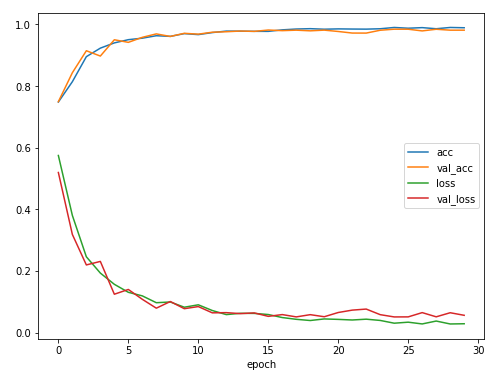

# 연습문제 1

> plane CNN 모델 결과 시각화

``` python
accuracy = training_plane.history.history['acc']
val_accuracy = training_plane.history.history['val_acc']
loss = training_plane.history.history['loss']
val_loss = training_plane.history.history['val_loss']

plt.figure(figsize=(8,6))

plt.plot(accuracy, label='acc')
plt.plot(val_accuracy, label='val_acc')
plt.plot(loss, label='loss')
plt.plot(val_loss, label='val_loss')

plt.xlabel('epoch')
plt.legend()
```



# 연습문제 2

> sonar.csv 이진분류 keras 모델

```python
# 모델 골격을 만들어 저장

base_model = Sequential([
    Dense(128, activation='relu', input_shape=[60]),
    Dense(64, activation='relu'),
    Dropout(0.2),
    
    Dense(64, activation='relu'),
    Dense(32, activation='relu'),
    Dropout(0.2),    
    Dense(1, activation='sigmoid')
])

base_model.save('base_model.h5')

# callback함수 생성
from keras.callbacks import EarlyStopping, ModelCheckpoint
es = EarlyStopping(patience=20, monitor='val_loss')

mcp = ModelCheckpoint('sonar_model/sonar_model.h5',
               monitor='val_loss',
               verbose=1,
               save_best_only=True)

# keras 모델링
from keras.models import Sequential
from keras.layers import *
from keras.models import load_model

# 저장해둔 모델 골격 불러오기
sonar_model = load_model('base_model.h5')

# 모델 설정
sonar_model.compile(loss='mse', optimizer='adam', metrics=['accuracy'])

# 모델 학습 및 평가
sonar_model.fit(xTrain, yTrain, epochs=200, batch_size=80, validation_split=0.3, callbacks=[es, mcp])

sonar_model.evaluate(xTest, yTest)
->[0.12599345544974008, 0.8333333134651184]
```

> k-fold 교차검증

```python
from sklearn.model_selection import StratifiedKFold

# k-fold 교차검증 (k=5)
kfold = StratifiedKFold(n_splits=5, shuffle=True, random_state=seed) 

# 테스트 acc를 담을 리스트 생성
score = []


for train, test in kfold.split(x,y) :
    # 정확도가 0.88이 나왔던 모델 불러와서 테스트
    sonar_model = load_model('sonar_model/sonar_model(0.88).h5')
	# 모델 설정
    sonar_model.compile(loss='mse', optimizer='adam', metrics=['accuracy'])
    # 모델 학습
    sonar_model.fit(x.iloc[train,:], y[train], epochs=200, batch_size=80,
                    validation_data=[x.iloc[test,:],y[test]], callbacks=[es])
	# 모델 평가 점수 저장
    score.append(sonar_model.evaluate(x.iloc[test,:], y[test])[1])

# 각 데이터 셋에 대해 학습한 모델의 acc 평균 출력
print('교차검증 Acc : ',np.mean(score))

교차검증 Acc :  0.8892877340316773
```

